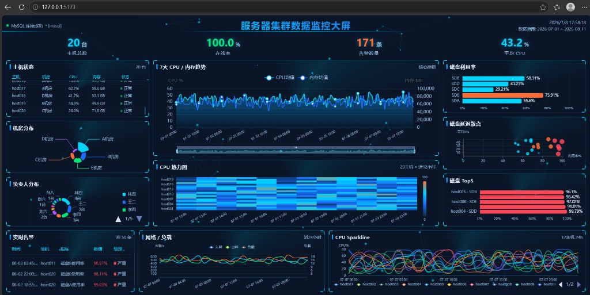
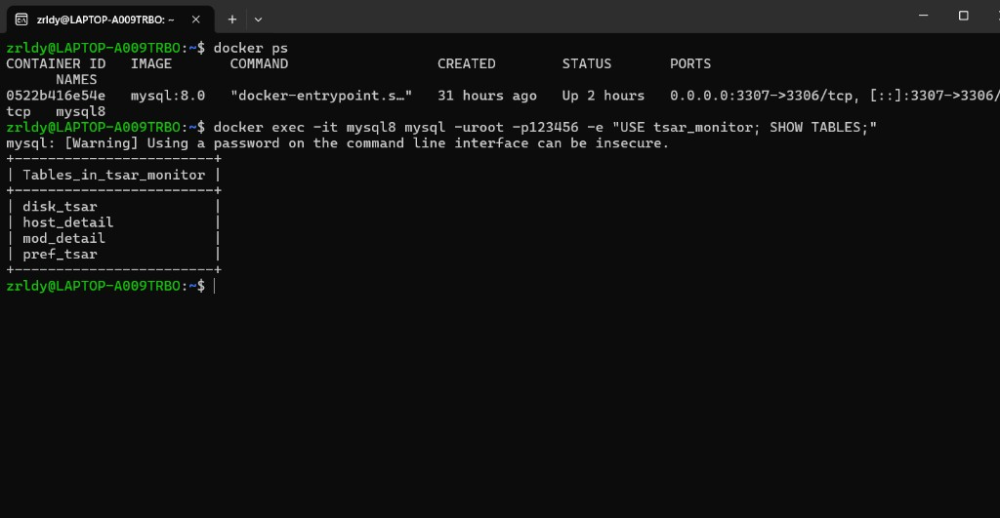
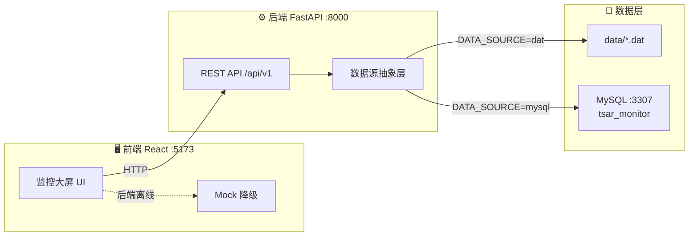

<div align="center">

<!-- 顶部横幅 -->


<br/>

[](https://www.python.org/)
[](https://fastapi.tiangolo.com/)
[](https://react.dev/)
[](https://www.typescriptlang.org/)
[](https://echarts.apache.org/)
[](https://www.mysql.com/)
[](LICENSE)

**20 台主机 · 55 项指标 · 7 天时序 · 科技感大屏**

[实际效果](#-实际运行效果) ·
[快速部署](#-快速部署) ·
[项目目录](#-项目目录) ·
[功能特性](#-功能特性) ·
[数据源切换](#-数据源切换) ·
[常见问题](#-常见问题)

</div>

---

## 📸 实际运行效果

**监控大屏（MySQL 模式 · 127.0.0.1:5173）**



**MySQL 数据库验证（docker · tsar_monitor 四表）**



| 指标 | 截图中实测值 |
|------|-------------|
| 主机总数 | 20 台 |
| 在线率 | 100% |
| 告警数量 | 171 条 |
| 平均 CPU | 43.2% |
| 数据源 | MySQL 连接成功 `[mysql]` |
| 数据库表 | `host_detail` · `mod_detail` · `pref_tsar` · `disk_tsar` |

---

## 📖 项目简介

**服务器集群数据监控大屏** 是一套面向运维场景的数据可视化系统，基于四表星型模型（`host_detail` / `mod_detail` / `pref_tsar` / `disk_tsar`）构建：

- 🖥️ **20 台服务器** CPU、内存、磁盘、网络全维度监控
- 📊 **多样化图表**：折线、热力图、玫瑰图、环形图、散点图、滚动告警表
- 🔄 **双数据源**：预存 `.dat` 文件开箱即用，可切换 MySQL 实时查询
- ✨ **科技风 UI**：粒子背景、流光边框、数字翻滚、加载进度条
- 📱 **响应式布局**：桌面三栏大屏 + 平板/手机自适应

> 更多连接参数、SQL 注意事项见 [`提示.txt`](提示.txt)

---

## 🚀 快速部署

> **推荐路径**：先准备 MySQL → 配置 `.env` → 一键启动。全程在项目根目录 `digital_display_project/` 下操作。

### 环境要求

| 依赖 | 版本 | 说明 |
|------|------|------|
| Python | 3.11+ | 后端 FastAPI |
| Node.js | 18+ | 前端 Vite |
| Docker | 可选 | MySQL 容器（推荐） |

---

### 第一步：启动 MySQL 并导入数据

**方式 A — 已有 `mysql8` 容器（推荐，端口 3307）**

```bash
# 确认容器运行
docker ps --filter "name=mysql8"

# 导入预存 SQL（必须指定 utf8mb4，避免中文乱码）
docker exec -i mysql8 mysql -uroot -p123456 --default-character-set=utf8mb4 < output/import_data.sql

# 验证四张表
docker exec -it mysql8 mysql -uroot -p123456 --default-character-set=utf8mb4 \
  -e "USE tsar_monitor; SHOW TABLES;"
```

> 验证效果见文首 [MySQL 数据库验证截图](#-实际运行效果)。

**方式 B — 使用项目 docker-compose**

```bash
docker-compose up -d
# 注意：compose 默认库名 monitor_db，需改 .env 或手动 CREATE DATABASE tsar_monitor
mysql -h 127.0.0.1 -P 3307 -u root -p123456 --default-character-set=utf8mb4 < output/import_data.sql
```

> ⚠️ **不要同时启动两个 MySQL 占 3307 端口**（`mysql8` 与 `docker-compose` 二选一）。

**连接参数速查**

| 配置项 | 值 |
|--------|-----|
| 主机 | `127.0.0.1` |
| 端口 | `3307`（宿主机）→ `3306`（容器内） |
| 用户 / 密码 | `root` / `123456` |
| 库名 | **`tsar_monitor`**（不是 monitor_db） |

---

### 第二步：配置后端

```bash
cd backend
copy .env.example .env     # Windows
# cp .env.example .env     # Linux / macOS
```

编辑 `backend/.env`：

```env
DATA_SOURCE=mysql
MYSQL_HOST=127.0.0.1
MYSQL_PORT=3307
MYSQL_USER=root
MYSQL_PASSWORD=123456
MYSQL_DATABASE=tsar_monitor
```

> 若无需数据库，可设 `DATA_SOURCE=dat`，直接读取项目根目录 `data/*.dat`。

验证后端连接：

```bash
curl http://127.0.0.1:8000/api/v1/health/db
# 期望: "mysql_connected": true, "message": "MySQL 连接成功"
```

---

### 第三步：启动项目

**方式一：一键启动（Windows 推荐）**

```bat
start.bat    # 自动安装依赖 → 启动后端 → 启动前端 → 打开浏览器
stop.bat     # 停止服务
```

**方式二：手动启动**

```bash
# 终端 1 — 后端
cd backend
pip install -r requirements.txt
uvicorn app.main:app --reload --host 127.0.0.1 --port 8000

# 终端 2 — 前端
cd frontend
npm install
npm run dev -- --host 127.0.0.1
```

**访问地址**

| 服务 | 地址 |
|------|------|
| 🖥️ **监控大屏** | http://127.0.0.1:5173 |
| 📚 API 文档 | http://127.0.0.1:8000/docs |
| ❤️ 健康检查 | http://127.0.0.1:8000/api/v1/health/db |

> MySQL 模式首次加载约 **7.9 万条**时序数据，请耐心等待顶部进度条完成，勿刷新中断。

---

## 🗂️ 项目目录

```
digital_display_project/                 ← 项目总目录（所有代码与预存数据均在此）
│
├── 📄 README.md                         项目说明（本文件）
├── 📄 提示.txt                          连接参数 / SQL / 排错速查
├── 🚀 start.bat                         Windows 一键启动
├── 🛑 stop.bat                          Windows 一键停止
├── 🐳 docker-compose.yml                MySQL 容器编排（可选）
│
├── 📂 data/                             ★ 预存原始数据（TSV 制表符分隔）
│   ├── host_detail.dat                  主机维度（20 行）
│   ├── mod_detail.dat                   指标维度（55 行）
│   ├── pref_tsar.dat                    性能时序（67,200 行）
│   └── disk_tsar.dat                    磁盘时序（12,000 行）
│
├── 📂 output/                           ★ 导出产物
│   └── import_data.sql                  MySQL 全量建表 + 导入脚本
│
├── 📂 docs/
│   └── images/                          README 截图资源
│       ├── dashboard-screenshot.png
│       └── mysql-database-screenshot.png
│
├── 📂 scripts/                          数据工具脚本
│   ├── generate_mysql_sql.py            data/*.dat → output/import_data.sql
│   └── export_mock_data.py              data/*.dat → frontend mock 快照
│
├── 📂 backend/                          FastAPI 后端 (:8000)
│   ├── .env.example                     环境变量模板
│   ├── .env                             本地配置（git 忽略，需自行创建）
│   ├── requirements.txt
│   └── app/
│       ├── main.py                      应用入口 + CORS
│       ├── config.py                    配置（DATA_DIR 指向 ../data/）
│       ├── routers/                     API 路由
│       │   ├── overview.py              KPI 总览
│       │   ├── hosts.py                 主机 & 分布
│       │   ├── metrics.py               趋势 / 热力图 / 磁盘 / Sparkline
│       │   └── health.py                数据源健康检查
│       ├── services/
│       │   ├── dat_reader.py            .dat 文件读取
│       │   ├── mysql_reader.py          MySQL 读取（charset=utf8mb4）
│       │   ├── reader.py                按 DATA_SOURCE 切换读取器
│       │   ├── aggregator.py            数据聚合（告警 / 趋势 / 分布）
│       │   └── datasource/              数据源抽象层
│       │       ├── mysql_source.py      MySQL 数据源 + 健康检查
│       │       └── dat_source.py        .dat 数据源（复用 mysql 层）
│       └── schemas/
│           └── response.py              Pydantic 响应模型
│
└── 📂 frontend/                         React 前端 (:5173)
    ├── vite.config.ts                   开发代理 /api → :8000
    ├── package.json
    └── src/
        ├── pages/
        │   └── MonitorScreen.tsx        监控大屏主页面
        ├── api/
        │   ├── client.ts                Axios + 离线降级探测
        │   ├── index.ts                 接口函数
        │   └── types.ts                 TypeScript 类型
        ├── components/
        │   ├── charts/                  ECharts 图表组件
        │   │   ├── TrendChart.tsx       7 天 CPU/内存趋势
        │   │   ├── HeatmapChart.tsx     CPU 热力图
        │   │   ├── LocationRose.tsx     机房玫瑰图
        │   │   ├── OwnerBar.tsx         负责人环形图
        │   │   ├── DiskGauge.tsx        磁盘利用率
        │   │   ├── DiskScatter.tsx      磁盘延迟散点
        │   │   ├── DiskTopBar.tsx       磁盘 Top5
        │   │   ├── NetLoadChart.tsx     网络/负载
        │   │   ├── SparklineMatrix.tsx  CPU Sparkline
        │   │   └── HostStatusTable.tsx  主机状态表
        │   ├── common/                  边框 / 标题 / 滚动表 / Toast
        │   └── effects/                 粒子背景 / 扫描线
        ├── mock/
        │   ├── data.json                ★ 前端离线快照（后端不可达时降级）
        │   └── index.ts                 Mock 数据路由
        └── styles/                      SCSS 主题 & 大屏布局
```

### 预存数据三层结构

| 层级 | 路径 | 用途 |
|------|------|------|
| 原始数据 | `data/*.dat` | 后端 `DATA_SOURCE=dat` 直接读取 |
| MySQL 脚本 | `output/import_data.sql` | 导入 Docker / 本地 MySQL |
| 前端快照 | `frontend/src/mock/data.json` | 后端离线时前端自动降级 |

```bash
# 重新生成 SQL
python scripts/generate_mysql_sql.py

# 重新生成前端快照
python scripts/export_mock_data.py
```

---

## ✨ 功能特性

<table>
<tr>
<td width="50%">

### 🎯 核心 KPI
- 主机总数 / 在线率
- 告警数量 / 平均 CPU
- 实时时钟与数据时间范围
- 数据源状态指示灯

### 📈 性能监控（中栏）
- 7 天 CPU + 内存双轴趋势图
- 20 主机 × 近 12 小时 CPU 热力图
- dataZoom 缩放浏览

</td>
<td width="50%">

### 💾 磁盘 & 网络
- 磁盘利用率条形图
- 延迟散点图（利用率 vs 等待时间）
- 磁盘 Top5 排行
- 网络流量 / 系统负载折线

### 🚨 告警 & 明细
- CPU > 80% / 磁盘 > 90% 自动告警
- 无缝滚动告警表
- 12 主机 CPU Sparkline 多线图
- 主机状态 / 机房 / 负责人分布

</td>
</tr>
</table>

---

## 🏗️ 系统架构



---

## 📦 数据模型

| 表名 | 类型 | 行数 | 说明 |
|------|------|------|------|
| `host_detail` | 维度表 | 20 | 主机信息（机房、负责人、型号） |
| `mod_detail` | 维度表 | 55 | 指标字典（CPU/内存/磁盘/网络） |
| `pref_tsar` | 事实表 | 67,200 | 性能时序（每小时采样） |
| `disk_tsar` | 事实表 | 12,000 | 磁盘 I/O 时序（约 5 分钟采样） |

关联关系：`pref_tsar` / `disk_tsar` 通过 `hostid`、`mod` 分别关联两张维度表。

> SQL 中 `mod`、`desc` 为 MySQL 保留字，查询时需加反引号：`` `mod` ``、`` `desc` ``

---

## 🔌 数据源切换

| 模式 | 环境变量 | 适用场景 |
|------|----------|----------|
| `.dat` 文件 | `DATA_SOURCE=dat` | 默认，无需数据库，开箱即用 |
| MySQL | `DATA_SOURCE=mysql` | 完整部署，与生产环境一致 |

切换后**重启后端**即可，前端无需改动。

---

## 📡 API 接口

| 方法 | 端点 | 说明 |
|------|------|------|
| `GET` | `/api/v1/overview` | KPI 总览 |
| `GET` | `/api/v1/hosts` | 主机列表及实时指标 |
| `GET` | `/api/v1/hosts/distribution` | 机房 / 型号 / 负责人分布 |
| `GET` | `/api/v1/metrics/pref/trend` | CPU + 内存 7 天趋势 |
| `GET` | `/api/v1/metrics/pref/heatmap` | CPU 热力图 |
| `GET` | `/api/v1/metrics/disk/top` | 磁盘 Top + 散点 |
| `GET` | `/api/v1/metrics/disk/gauges` | 磁盘利用率 |
| `GET` | `/api/v1/metrics/sparklines` | 各主机 CPU 迷你折线 |
| `GET` | `/api/v1/metrics/net-load` | 网络流量 / 负载 |
| `GET` | `/api/v1/alerts` | 阈值告警列表 |
| `GET` | `/api/v1/health/db` | 数据源 / 数据库连接状态 |

完整交互式文档：http://127.0.0.1:8000/docs

---

## 🎨 大屏布局

```
┌──────────────────────────────────────────────────────────────┐
│  ● 数据源状态  │   服务器集群数据监控大屏   │  时钟 / 数据范围  │
│         主机数  │  在线率  │  告警数  │  平均 CPU            │
├────────────┬─────────────────────────┬─────────────────────┤
│ 主机状态表  │   7天 CPU/内存趋势 ⭐    │  磁盘利用率条形图    │
│ 机房玫瑰图  │   CPU 热力图             │  磁盘延迟散点        │
│ 负责人分布  │                         │  磁盘 Top5           │
├────────────┴─────────────────────────┴─────────────────────┤
│  告警滚动表   │   网络/负载折线   │   CPU Sparkline 多线    │
└──────────────────────────────────────────────────────────────┘
```

---

## 🛠️ 生产部署（可选）

```bash
# 构建前端
cd frontend && npm run build    # 产物 → frontend/dist/

# 生产模式后端
cd backend
uvicorn app.main:app --host 0.0.0.0 --port 8000 --workers 2
```

Nginx 反向代理示例：

```nginx
server {
    listen 80;
    server_name monitor.example.com;

    location / {
        root /path/to/frontend/dist;
        try_files $uri $uri/ /index.html;
    }

    location /api/ {
        proxy_pass http://127.0.0.1:8000;
        proxy_set_header Host $host;
        proxy_set_header X-Real-IP $remote_addr;
    }
}
```

---

## ❓ 常见问题

<details>
<summary><b>Q: 页面只有蓝色背景，没有内容？</b></summary>

1. 确认后端已启动（`start.bat` 或手动 uvicorn）
2. 浏览器访问 http://127.0.0.1:5173
3. 按 F12 查看控制台报错
4. 若后端离线，确认 `frontend/src/mock/data.json` 存在

</details>

<details>
<summary><b>Q: MySQL 连接失败？</b></summary>

- 端口为 **3307**（非容器内 3306）
- 库名为 **tsar_monitor**
- `backend/.env` 中 `DATA_SOURCE=mysql`
- 访问 `/api/v1/health/db` 查看详细错误

</details>

<details>
<summary><b>Q: 中文乱码？</b></summary>

导入 SQL 时必须指定字符集：

```bash
docker exec -i mysql8 mysql -uroot -p123456 --default-character-set=utf8mb4 < output/import_data.sql
```

验证：`SELECT owner FROM host_detail LIMIT 3` 应显示「陈三」而非 `陈三`。已损坏的数据需清空后重新导入。

</details>

<details>
<summary><b>Q: 数据库连接成功但加载很慢？</b></summary>

正常现象。MySQL 模式查询约 7.9 万条时序记录，首次加载需数十秒，请等待顶部进度条完成。

</details>

<details>
<summary><b>Q: 图表空白或元素重叠？</b></summary>

- Ctrl+F5 强制刷新
- 建议全屏（F11），分辨率 ≥ 1280px
- 窗口较小时可向下滚动

</details>

---

## 📄 License

MIT License — 自由使用、修改和分发。

---

<div align="center">


**如果这个项目对你有帮助，欢迎 Star ⭐**

</div>
