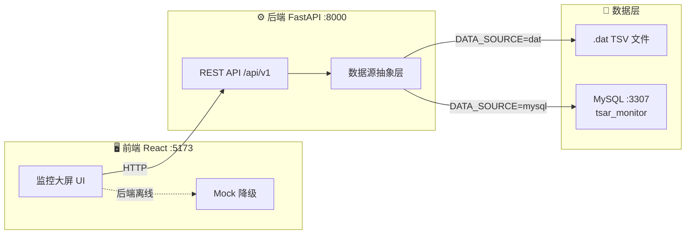

<div align="center">

<!-- 顶部横幅 -->


<br/>

[](https://www.python.org/)
[](https://fastapi.tiangolo.com/)
[](https://react.dev/)
[](https://www.typescriptlang.org/)
[](https://echarts.apache.org/)
[](https://www.mysql.com/)
[](LICENSE)

**20 台主机 · 55 项指标 · 7 天时序 · 科技感大屏**

[快速开始](#-快速开始) ·
[功能特性](#-功能特性) ·
[部署指南](#-部署指南) ·
[API 文档](#-api-接口) ·
[数据源切换](#-数据源切换)

</div>

---

## 📖 项目简介

**服务器集群数据监控大屏** 是一套面向运维场景的数据可视化系统，基于真实服务器监控数据（`host_detail` / `mod_detail` / `pref_tsar` / `disk_tsar` 四表星型模型）构建，提供：

- 🖥️ **20 台服务器** 的 CPU、内存、磁盘、网络全维度监控
- 📊 **多样化图表**：折线、热力图、玫瑰图、散点图、条形图、滚动告警表
- 🔄 **双数据源**：默认读取 `.dat` 文件，可无缝切换至 MySQL
- ✨ **科技风 UI**：粒子背景、流光边框、数字翻滚、无缝滚动告警
- 📱 **响应式布局**：桌面三栏大屏 + 平板/手机自适应

---

## ✨ 功能特性

<table>
<tr>
<td width="50%">

### 🎯 核心 KPI
- 主机总数 / 在线率
- 告警数量 / 平均 CPU
- 实时时钟与数据时间范围
- 数据源状态指示灯

### 📈 性能监控（中栏焦点）
- 7 天 CPU + 内存双轴趋势图
- 20 主机 × 近 12 小时 CPU 热力图
- 支持 dataZoom 缩放浏览

</td>
<td width="50%">

### 💾 磁盘 & 网络
- 磁盘利用率横向条形图
- 延迟散点图（利用率 vs 等待时间）
- 磁盘 Top5 排行
- 网络流量 / 系统负载折线

### 🚨 告警 & 明细
- CPU > 80% / 磁盘 > 90% 自动告警
- 无缝滚动告警表
- 12 主机 CPU Sparkline 多线图
- 主机状态 / 机房 / 负责人分布

</td>
</tr>
</table>

---

## 🏗️ 系统架构



---

## 🗂️ 项目结构

```
digital_display_project/
├── 📄 README.md                 # 项目说明（本文件）
├── 🚀 start.bat                 # Windows 一键启动
├── 🛑 stop.bat                  # Windows 一键停止
├── 🐳 docker-compose.yml        # MySQL 容器（可选）
├── 📜 scripts/
│   └── export_mock_data.py      # 导出前端 Mock 快照
├── ⚙️ backend/
│   ├── data/                    # .dat 原始数据（4 个文件）
│   ├── .env.example             # 环境变量模板
│   ├── requirements.txt
│   └── app/
│       ├── main.py              # FastAPI 入口
│       ├── config.py            # 配置管理
│       ├── routers/             # API 路由
│       ├── services/              # 数据读取 & 聚合
│       │   └── datasource/      # dat / mysql 双实现
│       └── schemas/             # Pydantic 响应模型
└── 🎨 frontend/
    ├── src/
    │   ├── api/                 # Axios 接口封装
    │   ├── components/          # 图表 & 特效组件
    │   ├── pages/               # MonitorScreen 大屏页
    │   ├── mock/                # 离线降级数据
    │   └── styles/              # SCSS 主题 & 布局
    ├── package.json
    └── vite.config.ts           # 开发代理 /api → :8000
```

---

## 📦 数据模型

| 表名 | 类型 | 行数 | 说明 |
|------|------|------|------|
| `host_detail` | 维度表 | 20 | 主机信息（机房、负责人、型号） |
| `mod_detail` | 维度表 | 55 | 指标字典（CPU/内存/磁盘/网络） |
| `pref_tsar` | 事实表 | 67,200 | 性能时序（每小时采样） |
| `disk_tsar` | 事实表 | 12,000 | 磁盘 I/O 时序（约 5 分钟采样） |

---

## 🚀 快速开始

### 环境要求

| 依赖 | 版本 |
|------|------|
| Python | 3.11+ |
| Node.js | 18+ |
| npm | 9+ |
| Docker（可选） | 用于 MySQL |

### 方式一：一键启动（Windows 推荐）

```bat
# 双击或在命令行执行
start.bat
```

自动完成：依赖安装 → 启动后端 → 启动前端 → 打开浏览器

```bat
# 停止服务
stop.bat
```

### 方式二：手动启动

**① 启动后端**

```bash
cd backend
pip install -r requirements.txt
cp .env.example .env        # Linux/macOS
copy .env.example .env      # Windows
uvicorn app.main:app --reload --host 127.0.0.1 --port 8000
```

**② 启动前端**

```bash
cd frontend
npm install
npm run dev -- --host 127.0.0.1
```

**③ 访问**

| 服务 | 地址 |
|------|------|
| 🖥️ 监控大屏 | http://127.0.0.1:5173 |
| 📚 API 文档 | http://127.0.0.1:8000/docs |
| ❤️ 健康检查 | http://127.0.0.1:8000/api/v1/health/db |

---

## 🛠️ 部署指南

### 开发环境

```bash
# 后端热重载
cd backend && uvicorn app.main:app --reload --port 8000

# 前端热重载
cd frontend && npm run dev
```

### 生产构建

```bash
# 构建前端静态资源
cd frontend
npm run build
# 产物在 frontend/dist/

# 生产模式启动后端（托管 API）
cd backend
uvicorn app.main:app --host 0.0.0.0 --port 8000 --workers 2
```

生产环境可将 `frontend/dist` 部署至 Nginx，并反向代理 `/api` 到 FastAPI：

```nginx
server {
    listen 80;
    server_name monitor.example.com;

    location / {
        root /path/to/frontend/dist;
        try_files $uri $uri/ /index.html;
    }

    location /api/ {
        proxy_pass http://127.0.0.1:8000;
        proxy_set_header Host $host;
        proxy_set_header X-Real-IP $remote_addr;
    }
}
```

### Docker MySQL（可选）

```bash
# 启动 MySQL 容器（端口 3307）
docker-compose up -d

# 导入数据（示例）
mysql -h 127.0.0.1 -P 3307 -u root -p123456 < ../output/import_data.sql
```

> ⚠️ 若已有 `mysql8` 容器占用 3307 端口，请勿重复启动 `docker-compose` 中的 MySQL。

---

## 🔌 数据源切换

### 模式对比

| 模式 | 环境变量 | 适用场景 |
|------|----------|----------|
| `.dat` 文件 | `DATA_SOURCE=dat` | 默认，开箱即用，无需数据库 |
| MySQL | `DATA_SOURCE=mysql` | 生产环境，支持实时写入 |

### 配置 `backend/.env`

```env
# 文件模式（默认）
DATA_SOURCE=dat

# MySQL 模式
DATA_SOURCE=mysql
MYSQL_HOST=127.0.0.1
MYSQL_PORT=3307
MYSQL_USER=root
MYSQL_PASSWORD=123456
MYSQL_DATABASE=tsar_monitor
```

切换后**重启后端**即可，前端 API 无需任何改动。

验证连接：

```bash
curl http://127.0.0.1:8000/api/v1/health/db
# 期望: "mysql_connected": true
```

---

## 📡 API 接口

| 方法 | 端点 | 说明 |
|------|------|------|
| `GET` | `/api/v1/overview` | KPI 总览（主机数、告警、平均 CPU） |
| `GET` | `/api/v1/hosts` | 主机列表及实时指标 |
| `GET` | `/api/v1/hosts/distribution` | 机房 / 型号 / 负责人分布 |
| `GET` | `/api/v1/metrics/pref/trend` | CPU + 内存 7 天趋势 |
| `GET` | `/api/v1/metrics/pref/heatmap` | CPU 热力图 |
| `GET` | `/api/v1/metrics/disk/top` | 磁盘 Top + 散点数据 |
| `GET` | `/api/v1/metrics/disk/gauges` | 磁盘利用率 |
| `GET` | `/api/v1/metrics/sparklines` | 各主机 CPU 迷你折线 |
| `GET` | `/api/v1/metrics/net-load` | 网络流量 / 负载 |
| `GET` | `/api/v1/alerts` | 阈值告警列表 |
| `GET` | `/api/v1/health/db` | 数据库连接状态 |

完整交互式文档：http://127.0.0.1:8000/docs

---

## 🎨 大屏布局

```
┌──────────────────────────────────────────────────────────────┐
│  ● 数据源状态  │   服务器集群数据监控大屏   │  时钟 / 数据范围  │
│         主机数  │  在线率  │  告警数  │  平均 CPU            │
├────────────┬─────────────────────────┬─────────────────────┤
│ 主机状态表  │   7天 CPU/内存趋势 ⭐    │  磁盘利用率条形图    │
│ 机房玫瑰图  │   CPU 热力图             │  磁盘延迟散点        │
│ 负责人分布  │                         │  磁盘 Top5           │
├────────────┴─────────────────────────┴─────────────────────┤
│  告警滚动表   │   网络/负载折线   │   CPU Sparkline 多线    │
└──────────────────────────────────────────────────────────────┘
```

---

## 🔄 前端离线降级

后端未启动时，前端自动使用 `frontend/src/mock/data.json` 中的快照数据，确保大屏仍可预览。

重新生成快照：

```bash
python scripts/export_mock_data.py
```

---

## ❓ 常见问题

<details>
<summary><b>Q: 页面只有蓝色背景，没有内容？</b></summary>

1. 确认后端已启动（`start.bat` 或手动 uvicorn）
2. 浏览器访问 http://127.0.0.1:5173（非 localhost）
3. 按 F12 查看控制台是否有报错
4. 若后端离线，确认 `frontend/src/mock/data.json` 存在

</details>

<details>
<summary><b>Q: MySQL 连接失败？</b></summary>

- 确认端口为 **3307**（非 3306）
- 确认库名为 **tsar_monitor**
- 检查 `backend/.env` 中 `DATA_SOURCE=mysql`
- 访问 `/api/v1/health/db` 查看详细错误信息

</details>

<details>
<summary><b>Q: 图表显示空白或重叠？</b></summary>

- 使用 Ctrl+F5 强制刷新
- 建议全屏（F11）查看，分辨率 ≥ 1280px 效果最佳
- 窗口较小时可向下滚动浏览

</details>

---

## 📄 License

MIT License — 自由使用、修改和分发。

---

<div align="center">


**如果这个项目对你有帮助，欢迎 Star ⭐**

</div>
